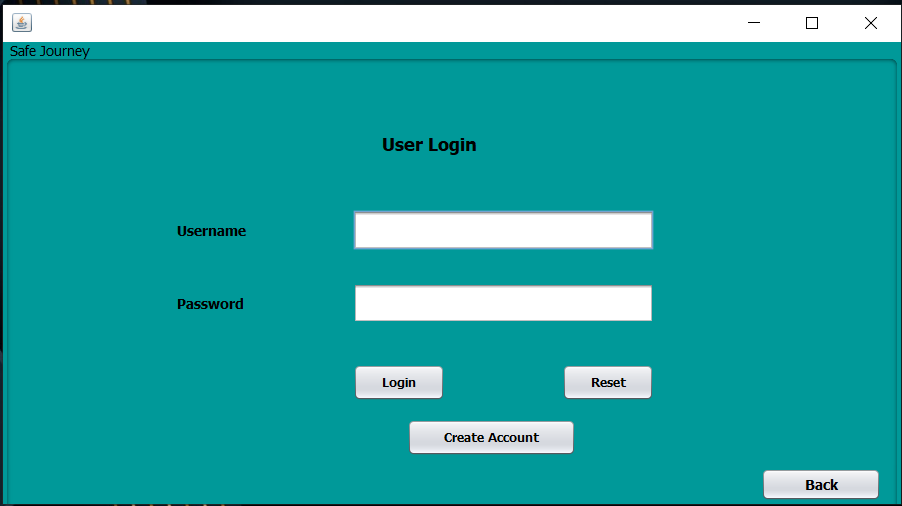

# JAVA swing project: Bus Ticket Management Desktop APP

<!-- &nbsp; -->

I did this project for learning purpose.

# Features
* CRUD - create, read, update, delete operation with search option
* JDBC
* Desktop app with java swing
* Nice and easy to use with a suitable view.
* MySql database system
# Screenshots
> Login page

For user , username 'ab' password 123
For admin. username 'a' password 123

> Other pages

# Requirements and Tools:
I did this project on Netbeans IDE.

You check this on your side. But You need to add three jar file.

* mysql-connector-java-8.0.12.jar
* jcalendar-1.4.jar
* rs2xml.jar
* calendar-1.4.jar
* DateChooser.jar

Don't forget to resolve those issue by adding jar files. You can use zip file to import the whole project.

# <a href="" ><strong>Project link</strong> </a>

---

<strong>Made by Shuvo Saha Roy with 💕 and 🤘</strong>
